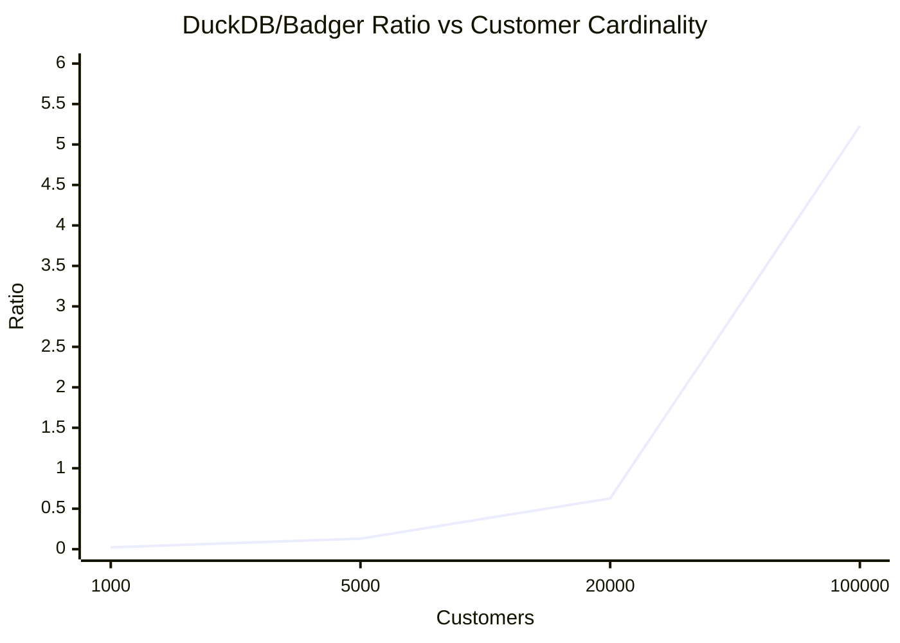

# DuckDB vs Badger Compare Summary

Run directory: artifacts/duckdb/20260722_212116_stress128

## Mode Summary

| Mode | Badger TPS/Ops | DuckDB TPS/Ops | DuckDB/Badger |
|---|---:|---:|---:|
| Point (Bank, no delay) | 14930 | 5191 | 0.348 |
| Point (Bank, 50us delay) | 12543 | 4762 | 0.380 |
| Read-heavy (Balance @ 100000 customers) | 618.802 | 3235.420 | 5.228522 |

## Crossover Curve

## Concurrency Matrix (excerpt)

| Customers | Workers | DuckDB/Badger |
|---:|---:|---:|
| 100000 | 4 | 3.433 |
| 100000 | 8 | 4.966 |
| 100000 | 16 | 6.331 |
| 100000 | 32 | 6.264 |
| 100000 | 64 | 6.276 |
| 100000 | 128 | 5.326 |
| 150000 | 4 | 5.271 |
| 150000 | 8 | 6.562 |
| 150000 | 16 | 7.331 |
| 150000 | 32 | 7.200 |
| 150000 | 64 | 6.965 |
| 150000 | 128 | 6.740 |
| 200000 | 4 | 5.405 |
| 200000 | 8 | 7.677 |
| 200000 | 16 | 6.560 |
| 200000 | 32 | 4.333 |
| 200000 | 64 | 9.576 |
| 200000 | 128 | 9.642 |

## Guardrail

OK: DuckDB/Badger ratio at 100000 customers is 5.228522, threshold 3.5.
